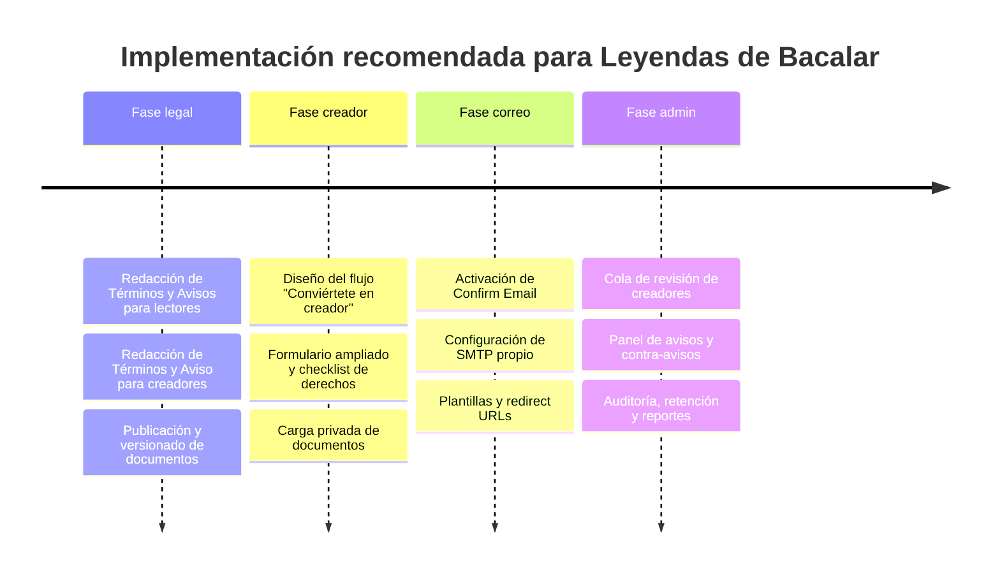

# Informe de investigación jurídica y de implementación para Leyendas de Bacalar

## Resumen ejecutivo

Para **Leyendas de Bacalar** conviene separar jurídicamente dos experiencias: la de **lectores/usuarios** y la de **creadores/autores**. Para lectores, el marco puede ser relativamente ligero: navegación anónima, exploración libre y registro sólo cuando la persona quiera guardar progreso, canjear un código, comentar, suscribirse o acceder a funciones avanzadas. Ese enfoque es compatible con la lógica de comercio electrónico y protección de datos en México, siempre que la plataforma informe con claridad términos, condiciones, costos o cargos aplicables, medios de contacto, cancelación cuando corresponda, y entregue el aviso de privacidad antes o al momento de recabar datos personales; además, debe distinguir entre finalidades necesarias y finalidades opcionales como marketing. citeturn16view0turn16view1turn11view0turn10view1turn25view2turn21view2turn21view3

Para creadores, en cambio, **no basta** con una cláusula tipo “el autor es el único responsable”. En México, una plataforma que almacena contenido subido por usuarios puede reducir exposición si opera con un esquema robusto de **declaraciones de titularidad**, **licencia de publicación**, **política de infractores reincidentes**, y un procedimiento funcional de **aviso, retiro, contra-aviso y preservación de evidencia**. La Ley Federal del Derecho de Autor prevé que los proveedores de servicios en línea no respondan automáticamente por contenidos de terceros, pero esa protección depende, entre otras cosas, de retirar o inhabilitar contenido de forma expedita cuando reciban aviso o resolución, contar con una política pública contra infractores reincidentes y no beneficiarse financieramente de la conducta infractora cuando tengan derecho y capacidad de controlarla. También existen sanciones por avisos falsos y por no retirar contenido expedita y razonablemente. citeturn37view0turn40view2turn40view1

El proyecto debe asumir otra realidad sensible: al tratarse de **leyendas y relatos culturales**, puede rozar tanto el régimen general de derecho de autor como la protección del **patrimonio cultural y la propiedad intelectual colectiva** de pueblos y comunidades indígenas y afromexicanas. Por ello, el flujo de creador debería exigir declaración expresa de autoría o autorización, trazabilidad de fuentes, revisión reforzada cuando una obra adapte relatos tradicionales o expresiones culturales comunitarias, y atribución adecuada de origen cuando corresponda. Si la plataforma se opera jurídicamente como privada, el eje de privacidad es la **LFPDPPP**; si la opera directamente una universidad pública o un sujeto obligado, el marco puede desplazarse a la **LGPDPPSO**, con órganos internos y obligaciones adicionales. Finalmente, para la confirmación real de correo y el flujo técnico, **Supabase Auth** sí permite exigir confirmación de email antes del primer inicio de sesión y, para producción, recomienda usar **SMTP propio** y no depender del proveedor integrado. citeturn9view3turn13view2turn27view0turn30view0turn34view0turn30view2turn33view1

Este documento es **investigación y propuesta de redacción** para revisión por asesoría jurídica local. **No constituye asesoría legal.**

## Alcance, supuestos y mapa normativo

### Supuestos no especificados

Hay varios puntos que no quedaron definidos y que cambian el diseño jurídico y técnico. Conviene tratarlos expresamente como **“no especificado”** hasta que el proyecto los cierre:

- **Naturaleza jurídica del operador**: no especificado. Si la plataforma la opera una entidad privada, la referencia principal es la LFPDPPP; si la opera directamente una universidad pública o sujeto obligado, entra la LGPDPPSO, que exige Comité de Transparencia, Unidad de Transparencia y estructuras específicas. citeturn9view0turn27view0
- **Modelo económico real**: no especificado. Si habrá suscripciones, renovaciones automáticas, cobros recurrentes o membresías, aplican con fuerza reforzada los artículos 76 Bis y 76 Bis 1 de la LFPC. citeturn16view0turn16view1
- **Tratamiento de menores de edad**: no especificado. Si se admitirán menores, hace falta revisión adicional de privacidad, UX y consentimiento de representación.
- **Uso de selfies, biometría o reconocimiento facial** en verificación de creadores: no especificado. Si se usa biometría, el aviso y la base de legitimación deben reforzarse expresamente. citeturn23view0turn26view8
- **Alcance de la licencia de publicación**: no especificado. Debe definirse si será exclusiva o no exclusiva; para una plataforma cultural normalmente conviene licencia **no exclusiva**, revocable en ciertos supuestos y delimitada por fines de publicación y difusión digital.
- **Si parte del contenido adaptará relatos o expresiones tradicionales comunitarias**: no especificado. Si sí, se recomienda crear revisión especial por patrimonio cultural. citeturn9view3turn13view2

### Núcleo normativo transversal

Para este proyecto, las fuentes mexicanas prioritarias y más útiles son las siguientes:

- **Ley Federal del Derecho de Autor**, Cámara de Diputados: bases de derecho moral, derecho patrimonial, licencias, limitaciones, régimen de proveedores de servicios en línea y sanciones. citeturn9view1turn13view0turn13view1turn37view0turn40view2
- **Ley Federal de Protección de Datos Personales en Posesión de los Particulares**, Cámara de Diputados: consentimiento, aviso de privacidad, seguridad, ARCO, transferencias y sanciones. citeturn9view0turn10view0turn10view1turn11view0turn11view1turn10view2
- **Reglamento de la LFPDPPP**, Cámara de Diputados: plazos de conservación, bloqueo, supresión, seguridad, análisis de riesgos y notificación de vulneraciones. citeturn24view0turn25view2turn25view3
- **Ley Federal de Protección al Consumidor**, Cámara de Diputados, y **Monitoreo de Tiendas Virtuales** de PROFECO: información previa, medios de contacto, medidas de seguridad, costos, cobros recurrentes, cancelación y buenas prácticas de interfaz para comercio digital. citeturn16view0turn16view1turn22view0
- **Guía para el Aviso de Privacidad**, INAI: modalidades del aviso, momento de puesta a disposición, redacción clara, evitar casillas pre-marcadas y diseño comprensible. citeturn9view4turn21view0turn21view1turn21view2turn21view3
- **Guía para el tratamiento de datos biométricos** y **Recomendaciones para incidentes de seguridad**, INAI: especial cuidado cuando haya biometría y protocolos de contención, mitigación y cadena de custodia. citeturn23view0turn23view1
- **INDAUTOR**, trámites de registro de obra y de contratos: útiles como evidencia documental y, en contratos, para efectos frente a terceros. citeturn14view1turn14view2
- **Ley Federal de Protección del Patrimonio Cultural de los Pueblos y Comunidades Indígenas y Afromexicanas**: regla especialmente relevante si la plataforma trabaja con leyendas, oralidad, relatos tradicionales o elementos culturales colectivos. citeturn9view3turn26view9
- **Código de Comercio**, para la fuerza jurídica de mensajes de datos y aceptaciones electrónicas, útil para registrar consentimientos y aceptaciones de términos. citeturn20view0turn20view1turn20view2

## Brief para lectores y usuarios

### Resumen ejecutivo

Para la capa de lectores, la estrategia correcta no es “cerrar todo tras el login”, sino dejar una **capa pública de descubrimiento** y mover el registro al momento en que exista una **relación jurídica clara**: crear cuenta, guardar favoritos, canjear código, gestionar biblioteca, comentar, recibir notificaciones o activar funciones más profundas. Jurídicamente, eso reduce tratamiento innecesario de datos y mejora la proporcionalidad del sistema. La LFPDPPP exige que el tratamiento sea necesario, adecuado y relevante para la finalidad; el Reglamento obliga a distinguir finalidades necesarias de las que no lo son. citeturn11view2turn25view2

Desde consumo y UX legal, si hay suscripciones o cualquier oferta electrónica, la plataforma debe mostrar de forma clara condiciones, medios de contacto, costos, cargos adicionales, medidas de seguridad y mecanismos de cancelación cuando proceda. PROFECO, además, toma como referencia práctica que una tienda virtual muestre datos de contacto, monto total a pagar, aviso de privacidad, cancelación y métodos de envío o entrega. Aunque Leyendas de Bacalar no sea una “tienda” tradicional, esa misma lógica ayuda a construir una experiencia transparente y defendible. citeturn16view0turn16view1turn22view0

La conclusión práctica es esta: para lectores sí conviene una **arquitectura jurídica simple**, pero no improvisada. Deben existir unos Términos para Lectores y un Aviso de Privacidad para Lectores, más un registro comprobable de versiones aceptadas. Si después deciden activar confirmación de correo para todos los usuarios, Supabase Auth soporta el flujo sin necesidad de backend propio para lo básico. citeturn30view0turn34view0turn30view2

### Leyes y fuentes oficiales mexicanas prioritarias

- **LFPDPPP**: aviso de privacidad, consentimiento, seguridad, derechos ARCO, transferencias y obligaciones del responsable. citeturn9view0turn10view0turn10view1turn10view2
- **Reglamento de la LFPDPPP**: plazos de conservación, procedimientos de bloqueo/supresión, seguridad y diferenciación de finalidades. citeturn25view2turn25view3
- **Guía para el Aviso de Privacidad (INAI)**: diseño claro, previo a la obtención de datos y sin casillas pre-marcadas. citeturn21view0turn21view1turn21view2turn21view3
- **LFPC**, artículos 76 Bis y 76 Bis 1: transacciones electrónicas, datos de contacto, condiciones, cobros recurrentes y cancelación. citeturn16view0turn16view1
- **Monitoreo de Tiendas Virtuales, PROFECO**: checklist práctico de cumplimiento visible al consumidor. citeturn22view0
- **Código de Comercio**: validez probatoria de mensajes de datos y aceptaciones electrónicas. citeturn20view1turn19view2

### Obligaciones y derechos clave

| Eje | Usuario / lector |
|---|---|
| Derecho a información | Debe conocer antes del registro qué datos se recaban, para qué, quién los trata y cómo ejercer ARCO. |
| Derecho a privacidad | Puede limitar el uso de datos, pedir acceso, rectificación, cancelación u oposición. |
| Derecho a claridad comercial | Si hay canje, suscripción o pago, debe ver términos, costos, medios de contacto y cancelación. |
| Derecho a no marketing forzado | Las finalidades promocionales deben separarse de las necesarias; no debe quedar suscrito por defecto. |
| Obligación de uso lícito | Debe usar la plataforma sin fraude, suplantación, scraping abusivo, acoso o vulneración de terceros. |
| Obligación de veracidad | Si crea cuenta o canjea un acceso, debe proporcionar información razonablemente veraz. |

Las bases normativas de este cuadro son el deber de información del aviso de privacidad, la existencia de derechos ARCO, la seguridad y confidencialidad en transacciones electrónicas, y la separación entre finalidades necesarias y no necesarias. citeturn11view0turn10view2turn16view0turn25view2turn41search11

### Cláusulas recomendadas para Términos y Condiciones de usuarios

Las siguientes cláusulas están pensadas como **texto sugerido** para una versión amigable, no agresiva, pero jurídicamente suficiente. Se inspiran en la LFPC, la LFPDPPP y el Código de Comercio. citeturn16view0turn16view1turn11view0turn20view2

1. **Objeto del servicio**  
   *“Leyendas de Bacalar es una plataforma digital para explorar, leer y, en su caso, activar contenidos culturales relacionados con leyendas, relatos y materiales vinculados al proyecto.”*

2. **Acceso público y cuenta**  
   *“Parte del contenido podrá consultarse sin crear cuenta. Para guardar biblioteca, activar códigos, recibir funcionalidades personalizadas o acceder a servicios adicionales, será necesario registrarse.”*

3. **Datos de la cuenta**  
   *“La persona usuaria se compromete a proporcionar datos de registro veraces y a mantener segura su contraseña. No deberá compartir su acceso con terceros ni usar cuentas ajenas sin autorización.”*

4. **Uso permitido**  
   *“La cuenta y los contenidos podrán utilizarse exclusivamente para fines personales, educativos, culturales o de lectura, salvo autorización expresa distinta por escrito.”*

5. **Usos prohibidos**  
   *“Queda prohibido copiar, redistribuir, revender, extraer masivamente, alterar mecanismos de acceso o utilizar la plataforma para conductas ilícitas, fraudulentas o que lesionen derechos de terceros.”*

6. **Propiedad intelectual del servicio**  
   *“Los textos, imágenes, marcas, diseño de interfaz, compilaciones y demás elementos del servicio pertenecen a sus respectivos titulares y sólo podrán utilizarse conforme a estos Términos y a la ley aplicable.”*

7. **Códigos y accesos**  
   *“Si la plataforma permite canjear códigos, cada código estará sujeto a sus reglas de activación, vigencia, uso individual y validación técnica.”*

8. **Cambios, mantenimiento y disponibilidad**  
   *“La plataforma podrá actualizar o suspender funcionalidades por mantenimiento, seguridad, cumplimiento legal o mejora del servicio, procurando informar cambios relevantes cuando sea razonable.”*

9. **Suspensión de cuenta**  
   *“La plataforma podrá suspender o restringir accesos cuando detecte uso indebido, fraude, ataques al sistema o incumplimientos graves a estos Términos.”*

10. **Contacto y aclaraciones**  
   *“La persona usuaria contará con medios visibles de contacto para aclaraciones, solicitudes o reportes relacionados con la plataforma.”*

### Cláusulas recomendadas para Aviso de Privacidad de usuarios

#### Puntos mínimos que no deberían faltar

Un Aviso de Privacidad para Lectores debería cubrir, como mínimo, identidad y domicilio del responsable, categorías de datos, finalidades necesarias y opcionales, mecanismos para limitar uso o divulgación, procedimiento ARCO, cambios al aviso y, si aplica, transferencias. El INAI recomienda además lenguaje claro, diseño comprensible, aviso previo a la obtención de datos y mecanismos no engañosos de consentimiento. citeturn11view0turn10view1turn21view0turn21view2turn21view3

#### Texto modelo corto

*“Leyendas de Bacalar, [responsable no especificado], tratará sus datos personales de identificación y contacto para crear y administrar su cuenta, gestionar su biblioteca, atender solicitudes, validar códigos de acceso, brindar soporte y mantener la seguridad de la plataforma. Si usted lo autoriza por separado, también podremos usar sus datos para enviar información cultural, novedades o invitaciones. Usted puede acceder, rectificar, cancelar u oponerse al tratamiento de sus datos, así como revocar su consentimiento para finalidades no necesarias, a través de [correo/formulario no especificado]. El aviso integral y sus actualizaciones estarán disponibles en [ruta web no especificada].”*

### Riesgos legales principales y mitigación

El principal riesgo para lectores no es copyright, sino **privacidad, transparencia y publicidad/consumo digital**. Si el registro pide más datos de los necesarios, si los fines de marketing se “mezclan” con los fines necesarios, o si la cancelación de servicios/cobros es oscura, el proyecto sube innecesariamente su exposición. La mitigación correcta es separar UX pública y UX registrada, usar checkbox distinto para marketing, documentar versiones de aviso y términos, y conservar registro del consentimiento. citeturn11view2turn25view2turn16view0turn16view1

Un segundo riesgo es de **incidentes de seguridad**. La LFPDPPP y su Reglamento exigen medidas administrativas, físicas y técnicas adecuadas; además, si una vulneración afecta significativamente derechos patrimoniales o morales del titular, debe informarse sin demora. El INAI recomienda documentar contención, mitigación, recuperación y, cuando proceda, cadena de custodia. citeturn11view1turn25view3turn10view5turn23view1

Un tercer riesgo es la **falta de evidencia**. Bajo el Código de Comercio, los mensajes de datos y evidencias electrónicas pueden surtir efectos jurídicos si la información se conserva íntegra y accesible. Por eso no basta con “mostrar un checkbox”: hay que guardar versión de documento, fecha/hora, medio de aceptación y evidencia del evento. citeturn20view1turn19view2

### Verificación de identidad y manejo de documentos

Para lectores, la recomendación fuerte es **no pedir identificación oficial** salvo que exista una causa concreta y documentada. Para un lector común, lo razonable es limitarse a correo electrónico, contraseña y, opcionalmente, nombre para personalización. Si después el proyecto decide verificar correo, eso puede hacerse sin capturar documentos oficiales. Pedir INE o pasaporte a todos los lectores sería difícil de justificar por minimización y necesidad. citeturn11view2turn25view2

Si hubiera alguna excepción —por ejemplo, soporte especial por fraude, disputa de acceso o satisfacción de obligaciones contractuales específicas— la documentación debería guardarse sólo el tiempo estrictamente necesario, con procedimientos documentados de conservación, bloqueo y supresión. El Reglamento exige precisamente documentar esos periodos y poder demostrar su cumplimiento. citeturn25view2

### Flujo operativo recomendado

El flujo operativo más sano para lectores sería:

1. **Exploración anónima** de home, biblioteca pública, previews y páginas informativas.
2. **Invitación a registrarse** sólo al intentar guardar biblioteca, canjear código, comentar o usar funciones personalizadas.
3. **Pantalla de registro simple** con checkbox de Términos para Lectores y Aviso de Privacidad para Lectores.
4. **Confirmación de correo** recomendable si quieren elevar seguridad o calidad de cuentas; técnicamente es viable con Supabase Auth. Si activan “Confirm Email”, Supabase devuelve el usuario pero no una sesión activa hasta que el correo se confirme. citeturn30view0turn34view0
5. **Ingreso al panel lector** ya con cuenta activa.
6. **Gestión ARCO y preferencias** desde perfil o centro de privacidad.

## Brief para creadores y autores

### Resumen ejecutivo

Para creadores, el estándar debe ser **más estricto** que para lectores, pero no por “formalismo”, sino por exposición legal real. Si un creador sube obra ajena, material sin licencia, contenido que invade privacidad, o relatos tradicionales respecto de los cuales no tiene autorización suficiente, la plataforma no queda mágicamente blindada porque el usuario haya aceptado un checkbox. La solución jurídicamente más sólida es combinar: identificación razonable del solicitante, declaraciones y garantías de titularidad, aceptación diferenciada de términos estrictos, licencia clara de publicación, panel de revisión administrativa, y un mecanismo operativo de aviso y retiro con preservación de evidencia. citeturn37view0turn40view2turn23view1

Además, en el ámbito autoral mexicano, deben respetarse tanto los **derechos morales** —por ejemplo, el reconocimiento de autoría, la integridad de la obra y la oposición a atribuciones falsas— como los **derechos patrimoniales**, que cubren reproducción, publicación, puesta a disposición en internet, comunicación pública, distribución y obras derivadas. Publicar una obra en plataforma implica necesariamente contar con una licencia o titularidad suficiente para esos actos. citeturn13view1turn13view0

Para Leyendas de Bacalar hay un matiz adicional: si un creador adapta mitos, relatos orales o expresiones culturales tradicionales ligadas a comunidades indígenas o afromexicanas, no basta con un “es mío porque yo lo escribí”. Debe abrirse una revisión de procedencia, atribución, contexto y, cuando aplique, autorizaciones comunitarias o documentación de uso legítimo. La ley mexicana protege la propiedad intelectual colectiva y el patrimonio cultural de esas comunidades; además, la LFDA contiene reglas específicas de atribución respecto de ciertas expresiones culturales. citeturn9view3turn13view2

### Leyes y fuentes oficiales mexicanas prioritarias

- **LFDA**, especialmente derechos morales, patrimoniales, limitaciones y proveedores de servicios en línea. citeturn13view1turn13view0turn37view0
- **LFPPCPCIA**, para contenido con vinculación a patrimonio cultural de pueblos y comunidades indígenas y afromexicanas. citeturn9view3turn26view9
- **INDAUTOR**, trámites de obra y contratos, útiles como soporte documental de autoría o cadena de derechos. citeturn14view1turn14view2
- **LFPDPPP** y su Reglamento, por el tratamiento de datos de verificación, documentos y expedientes del creador. citeturn11view0turn25view2turn25view3
- **INAI**, Guía para Aviso de Privacidad, Guía de biométricos y recomendaciones de incidentes. citeturn21view1turn23view0turn23view1
- **Código de Comercio**, para fuerza probatoria de aceptaciones, declaraciones y consentimientos electrónicos. citeturn20view1turn19view2

### Obligaciones y derechos clave

| Eje | Creador / autor |
|---|---|
| Derecho moral | Puede exigir reconocimiento de autoría y respeto a la obra; no puede ser falsamente atribuido. |
| Derecho patrimonial | Puede autorizar o prohibir reproducción, publicación, puesta a disposición, distribución y obras derivadas. |
| Deber de titularidad o autorización | Debe declarar y poder acreditar que es titular o cuenta con permisos suficientes para publicar. |
| Deber de licitud | No debe subir obras ajenas, material difamatorio, contenido que vulnere privacidad o contenido prohibido por ley. |
| Deber de exactitud documental | Si solicita ser creador, la información y documentos de verificación deben ser auténticos y vigentes. |
| Riesgo por reincidencia | Puede perder cuenta o privilegios de creador si incurre en infracciones reiteradas. |

Este cuadro se desprende del régimen de derechos morales y patrimoniales de la LFDA, así como del esquema de avisos, contra-avisos y política de reincidencia previsto para servicios en línea. citeturn13view1turn13view0turn37view0

### Cláusulas recomendadas para Términos y Condiciones de creadores

Aquí sí conviene una versión estricta. La base legal principal es la LFDA, reforzada por el régimen de proveedores de servicios en línea y, si aplica, por la ley de patrimonio cultural colectivo. citeturn13view1turn13view0turn37view0turn9view3

1. **Identidad verdadera del creador**  
   *“La persona que solicite o mantenga una cuenta de creador declara que su identidad, datos de contacto y documentación de verificación son veraces, completos y actuales.”*

2. **Declaración de autoría o de cadena de derechos**  
   *“La persona creadora declara, bajo protesta de decir verdad, que es autora de la obra o que cuenta con autorizaciones, cesiones o licencias suficientes para publicarla, reproducirla, comunicarla públicamente y ponerla a disposición del público a través de la plataforma.”*

3. **Contenido prohibido**  
   *“No se podrán publicar obras o materiales que infrinjan derechos de autor, derechos conexos, derechos de imagen, privacidad, datos personales, secreto profesional, normas penales o cualquier derecho de tercero.”*

4. **Relatos tradicionales y patrimonio cultural**  
   *“Cuando una obra adapte, derive o utilice total o parcialmente relatos tradicionales, expresiones culturales o elementos vinculados al patrimonio cultural de pueblos o comunidades indígenas o afromexicanas, la persona creadora deberá identificar el origen cultural de la obra, aportar la información y autorizaciones que resulten aplicables y abstenerse de incurrir en apropiación indebida.”*

5. **Licencia a favor de la plataforma**  
   *“La persona creadora otorga a la plataforma una licencia [recomendación: no exclusiva], revocable en los términos aquí previstos, para alojar, reproducir técnicamente, convertir de formato, mostrar, comunicar públicamente y poner a disposición la obra dentro del servicio, en los territorios y por el tiempo necesarios para su operación.”*

6. **Respeto a derechos morales**  
   *“La plataforma procurará respetar el crédito autoral y la integridad de la obra; cualquier ajuste técnico o editorial no deberá desnaturalizar el contenido sin la base contractual o legal correspondiente.”*

7. **Aviso, retiro y contra-aviso**  
   *“La plataforma podrá remover, retirar, inhabilitar o suspender contenido cuando reciba aviso de probable infracción, resolución de autoridad o detecte incumplimientos evidentes. La persona creadora podrá presentar contra-aviso y evidencia de titularidad o autorización.”*

8. **Infractores reincidentes**  
   *“La plataforma contará con una política pública de suspensión o terminación de cuentas de infractores reincidentes.”*

9. **Indemnidad y reembolso**  
   *“La persona creadora responderá frente a reclamaciones derivadas de falsedad en sus declaraciones o de falta de derechos suficientes sobre la obra, y deberá sacar en paz y a salvo a la plataforma en los términos permitidos por la ley aplicable.”*

10. **Falsedad documental y cancelación de la cuenta**  
   *“La presentación de documentación falsa, alterada o ajena será causa suficiente para rechazar la solicitud de creador, suspender publicaciones o cancelar la cuenta.”*

11. **Facultad de revisión administrativa**  
   *“La aprobación como creador y la publicación de obras estarán sujetas a revisión editorial y de cumplimiento; la plataforma podrá solicitar información adicional antes de aprobar o publicar.”*

12. **Conservación de evidencias**  
   *“La plataforma podrá conservar metadatos, registros de aceptación, evidencia técnica y documentación asociada a procesos de verificación, revisión y atención de reclamaciones, conforme al aviso de privacidad y a la normativa aplicable.”*

### Cláusulas recomendadas para Aviso de Privacidad de creadores

#### Puntos que deben diferenciarlo del aviso de lectores

El aviso de privacidad de creadores debe ser **separado** del de lectores porque el universo de datos y finalidades cambia: verificación reforzada, revisión editorial, conservación de evidencia, atención de reclamaciones autorales, administración de cuenta de creador y, si aplica, gestión contractual o de pagos. El Reglamento de la LFPDPPP desaconseja mezclar tratamientos con finalidades distintas si eso impide claridad. citeturn21view1turn25view2

Debe incluir, además, si se recaban documentos oficiales, categorías exactas de datos; si hay transferencias a proveedores tecnológicos; el periodo y la lógica de conservación; y el canal ARCO. Si se llegaran a usar biométricos o reconocimiento facial, eso debe describirse expresamente y con el nivel de cuidado reforzado sugerido por el INAI. citeturn11view0turn23view0

#### Texto modelo corto

*“Leyendas de Bacalar, [responsable no especificado], tratará los datos personales de las personas solicitantes o usuarias del módulo de creador para verificar identidad, evaluar solicitudes de alta como creador, administrar la cuenta, revisar obras y materiales, atender reclamaciones legales, prevenir fraudes y conservar evidencia de cumplimiento. Los datos podrán incluir información de identificación, contacto, trayectoria, documentación de soporte de titularidad y, en su caso, documentos oficiales de verificación. Usted podrá ejercer sus derechos ARCO y conocer el aviso integral en [ruta no especificada]. Si el proyecto utilizara mecanismos de validación biométrica o efectuara transferencias adicionales, ello se informará expresamente en el aviso integral correspondiente.”*

### Riesgos legales principales y mitigación

El riesgo más serio para el módulo de creador es el **copyright infringement**. La mitigación no es sólo contractual; debe ser **operativa**. La LFDA prevé que el proveedor de servicios en línea retire o inhabilite materiales de forma expedita cuando reciba aviso o resolución, que exista política de reincidencia, que haya notificación a quien subió el material y que pueda existir contra-aviso. Incluso la ley sanciona avisos o contra-avisos falsos y también la falta de retiro oportuno por parte del proveedor. citeturn37view0turn40view2

El segundo gran riesgo es la **apropiación o tratamiento indebido de patrimonio cultural colectivo**. En un proyecto de leyendas, esto no es accesorio. Debe existir una bandera de revisión específica para materiales basados en relatos tradicionales, comunidades identificables, expresiones culturales o patrimonios vivos. Como mínimo, conviene exigir fuente, contexto, crédito y documentación del derecho o autorización para uso por terceros cuando aplique. citeturn9view3turn13view2

El tercer riesgo es la **privacidad de terceros y la documentación del creador**. El expediente de creador puede contener ID, datos de contacto, pruebas de derechos y, eventualmente, evidencia de disputas. Todo eso exige medidas de seguridad, análisis de riesgo, acceso limitado por rol y plazos de conservación documentados. En incidentes, el INAI recomienda procesos de contención, mitigación y cadena de custodia. citeturn25view3turn25view2turn23view1

El cuarto riesgo es creer que una cláusula de “no somos responsables” basta para exonerar a la plataforma. Esa cláusula puede ayudar en distribución contractual del riesgo frente al creador, pero **no sustituye** el cumplimiento operativo previsto por la LFDA ni las obligaciones de privacidad. La forma jurídicamente más sensata de redactarla es como una combinación de: declaración de titularidad, garantía de licitud, facultad de retiro, cooperación del creador, indemnidad y procedimiento de aviso/contra-aviso. citeturn37view0turn40view2turn25view3

### Requisitos de verificación de identidad y manejo de documentos

Aquí la recomendación es gradual y proporcional:

**Nivel base**  
Correo confirmado, nombre real, apellidos, país/ciudad, biografía corta, y aceptación de Términos de Creador y Aviso de Privacidad de Creador. Técnicamente, Supabase soporta confirmación de correo antes del primer inicio de sesión. citeturn30view0turn34view0

**Nivel documental**  
Identificación oficial vigente, documento de soporte de derechos cuando no sea autor directo, y, si actúa por una persona moral o por otra persona, poder o representación bastante. Esto no surge como obligación general automática en la LFDA para toda plataforma, pero sí es una medida fuerte de gestión de riesgo y es coherente con la lógica documental de INDAUTOR para obra y contratos. citeturn14view1turn14view2

**Buenas prácticas de manejo**  
Los documentos no deberían quedar públicos ni en tablas expuestas. Lo recomendable es bucket privado, metadatos mínimos en base de datos, acceso sólo por personal autorizado, URLs firmadas de corta vigencia y eliminación posterior conforme a una tabla de retención. El Reglamento exige documentar conservación, bloqueo y supresión, y Supabase ofrece URLs firmadas temporales para acceso controlado a archivos. citeturn25view2turn30view5

**Biometría**  
No se recomienda usar selfie-match o reconocimiento facial salvo necesidad real. Si llegan a usarlo, se tendría que describir específicamente en el aviso, indicar finalidad, tipo de dato biométrico y, cuando el consentimiento sea necesario, habilitar un mecanismo claro de aceptación o negativa. citeturn23view0turn26view8

**Retención recomendada**  
- Solicitud rechazada: conservar expediente sólo por el tiempo necesario para atender aclaraciones, auditoría interna y plazos de posibles reclamaciones; después, bloquear y suprimir.  
- Solicitud aprobada: idealmente conservar **resultado** de verificación y metadatos, no la imagen del documento por tiempo indefinido, salvo que una necesidad contractual o legal lo justifique.  
- Exactitud del plazo: **no especificado**; debe definirse en una política de retención revisada por asesoría legal conforme al Reglamento y al modelo de negocio. citeturn25view2

### Flujo operativo recomendado

El flujo operativo recomendado para creadores sería:

1. **Navegación pública** como lector.
2. Click en **“Conviértete en creador”**.
3. **Registro básico** con correo y contraseña.
4. **Checkbox doble**: Términos de Creador + Aviso de Privacidad de Creador + declaración de autoría/lícita titularidad.
5. **Confirmación real de correo**.
6. **Formulario ampliado** de solicitud de creador.
7. **Carga de documentos** en entorno privado.
8. **Revisión administrativa** con estatus: pendiente, observado, aprobado, rechazado.
9. **Alta en panel de creador** sólo tras aprobación.
10. **Carga de obra** con checklist previo: titularidad, fuentes, obras derivadas, materiales de terceros, patrimonio cultural comunitario, uso de imagen/voz y datos de terceros.
11. **Publicación** o **observación legal/editorial**.
12. **Post-publicación** con mecanismo de reportes, retiro, contra-aviso y trazabilidad.

## Arquitectura operativa, datos y controles técnicos

### Modelo de datos sugerido

Si el proyecto ya cuenta con tablas como `users_profile`, `creator_applications`, `creator_profiles`, `content_reviews` o similares, conviene **ampliarlas** en vez de duplicarlas. Si no existen, estos nombres pueden tomarse como base.

| Tabla o ajuste sugerido | Aplica a | Columnas clave sugeridas | Finalidad jurídica y operativa |
|---|---|---|---|
| `legal_documents` | Ambos | `id`, `doc_type`, `version`, `locale`, `sha256`, `effective_at`, `published_at`, `url_path`, `is_active` | Versionar Términos, Avisos y políticas públicas. |
| `legal_acceptances` | Ambos | `id`, `user_id`, `doc_id`, `accepted_at`, `accepted_via`, `request_id`, `ip_hash`, `user_agent_hash`, `ui_locale`, `evidence_json` | Probar qué aceptó cada persona y cuándo. |
| `consent_preferences` | Usuarios | `user_id`, `marketing_opt_in`, `marketing_opt_in_at`, `marketing_opt_out_at`, `source` | Separar marketing del tratamiento necesario. |
| `users_profile` o equivalente | Usuarios | `reader_terms_version`, `reader_terms_accepted_at`, `reader_privacy_version`, `reader_privacy_accepted_at` | Cache legal visible en perfil sin sustituir tabla de aceptación. |
| `creator_applications` | Creadores | `user_id`, `status`, `submitted_at`, `creator_terms_version`, `creator_terms_accepted_at`, `creator_privacy_version`, `authorship_declared`, `rights_basis`, `portfolio_url`, `review_notes`, `reviewed_by`, `reviewed_at`, `rejection_reason` | Solicitud estricta, revisión y trazabilidad. |
| `identity_documents` | Creadores | `id`, `application_id`, `doc_type`, `storage_path`, `mime_type`, `checksum_sha256`, `uploaded_at`, `verified_status`, `verified_by`, `verified_at`, `retention_until`, `purged_at` | Guardar documentos fuera de tablas públicas y controlar retención. |
| `creator_profiles` | Creadores | `user_id`, `verification_level`, `creator_status`, `approved_at`, `approved_by`, `suspension_reason`, `suspended_at` | Estado operativo de creador. |
| `publication_rights_checks` | Creadores | `content_id`, `is_original`, `is_derivative`, `has_third_party_assets`, `community_heritage_flag`, `rights_evidence_path`, `completed_at` | Checklist previo a publicar. |
| `copyright_notices` | Creadores / terceros | `id`, `notice_type`, `claimant_name`, `claimant_contact`, `content_locator`, `rights_basis`, `statement_text`, `evidence_path`, `received_at`, `status`, `counter_notice_due_at`, `resolved_at` | Aviso, contra-aviso y cumplimiento LFDA. |
| `moderation_actions` | Ambos | `id`, `content_id`, `user_id`, `action_type`, `reason_code`, `legal_basis`, `performed_by`, `created_at`, `notes`, `evidence_ref` | Documentar retiro, suspensión, restauración y medidas. |
| `audit_events` | Ambos | `id`, `actor_user_id`, `actor_role`, `event_type`, `entity_table`, `entity_id`, `request_id`, `metadata_json`, `created_at` | Auditoría interna, soporte y prueba. |
| `content_reviews` o equivalente | Creadores | `content_id`, `copyright_flag`, `privacy_flag`, `heritage_flag`, `legal_hold`, `escalated_to_admin_at` | Revisión editorial/legal centralizada. |

**Nota importante:** para el estado de correo confirmado, la recomendación es usar como fuente de verdad el estado nativo de **Supabase Auth** y sólo crear una tabla adicional si necesitan trazabilidad ampliada de reenvíos, errores SMTP o eventos internos. Supabase permite exigir confirmación antes del primer inicio de sesión, configurar plantillas, redirect URLs y SMTP propio. citeturn30view0turn30view1turn30view2turn30view3

### Checklist de implementación técnica

La base técnica recomendada es consistente con Supabase: **Confirm Email**, SMTP propio para producción, plantillas de correo propias, RLS en tablas expuestas, documentos en bucket privado, URLs firmadas para acceso temporal y manejo estricto de secrets fuera del navegador. Supabase también documenta que las claves secretas o `service_role` **no deben usarse en browser**, y que RLS debe estar habilitado en tablas del esquema expuesto. citeturn32view0turn30view4turn30view5

| Área | Mínimo recomendable | Qué validar antes de salir a producción |
|---|---|---|
| Frontend legal | Páginas separadas para Términos/Aviso de usuarios y de creadores | URL estable, versionado visible, fecha de vigencia |
| Registro lector | Formulario simple + checkbox legal | Checkbox no pre-marcado; marketing separado |
| Rutas públicas | Biblioteca y previews accesibles sin cuenta | Ningún CTA de exploración debe forzar login prematuro |
| Confirmación de correo | Activar `Confirm Email` | Redirect URLs definidas; mensajes de confirmación claros |
| SMTP | SMTP propio | SPF/DKIM/DMARC y pruebas de entrega |
| Plantillas de correo | Confirmación, reenvío y mensajes de seguridad | Copys claros, branding y URLs correctas |
| Edge Functions | Revisión de creador, notificaciones administrativas, webhooks de correo si hace falta | Secrets sólo en función; logs activados |
| Storage privado | Bucket privado para documentos de creador | Acceso vía signed URLs y expiración corta |
| RLS | Activado para tablas públicas | Políticas por rol: lector, creador, admin |
| Takedown workflow | Formulario interno de aviso y módulo de contra-aviso | Estados, SLA interno, conservación de evidencia |
| Logs y auditoría | Eventos de aceptación, revisión y moderación | `request_id`, actor, timestamp, evidencia |
| Retención | Job programado de bloqueo/supresión | Política documentada y trazable |
| Admin panel | Cola de “creadores pendientes”, “reportes”, “avisos de copyright” | Vista centralizada y filtros por estatus |

Para depurar problemas de autenticación y correo, Supabase recomienda revisar el **Log Explorer** y los **Auth logs**; además, para producción insiste en usar SMTP propio y no depender del proveedor integrado, que es más adecuado para demos o pruebas. citeturn33view0turn33view1turn30view2

### Copys de interfaz sugeridos

| Caso | Copy sugerido |
|---|---|
| Checkbox de registro de usuario | **He leído y acepto los Términos para Lectores y el Aviso de Privacidad.** |
| Checkbox de creador | **Declaro que la información proporcionada es veraz, que cuento con los derechos necesarios sobre las obras que publique y que acepto los Términos para Creadores y el Aviso de Privacidad.** |
| Mensaje de confirmación de correo | **Te enviamos un correo para confirmar tu cuenta. Revisa tu bandeja de entrada y, si no lo encuentras, revisa spam o solicita un nuevo envío.** |
| Mensaje tras reenvío de correo | **Listo. Enviamos un nuevo correo de confirmación. El enlace tendrá una vigencia limitada.** |
| Aviso de panel creador pendiente | **Tu solicitud de creador fue recibida. La estamos revisando. Te avisaremos por correo cuando cambie de estatus.** |
| Notificación administrativa | **Nuevo registro de creador pendiente de revisión: [nombre/correo]. Ir a expediente.** |

### Cronograma sugerido

## Referencias priorizadas

### Fuentes oficiales mexicanas

- **Cámara de Diputados — Ley Federal del Derecho de Autor**: derechos morales, patrimoniales, limitaciones, avisos y contra-avisos, política de reincidencia y sanciones. citeturn9view1turn13view1turn13view0turn37view0turn40view2
- **Cámara de Diputados — Ley Federal de Protección de Datos Personales en Posesión de los Particulares**: principios, consentimiento, aviso, seguridad, ARCO y transferencias. citeturn9view0turn10view0turn10view1turn11view0turn11view1turn10view2
- **Cámara de Diputados — Reglamento de la LFPDPPP**: conservación, bloqueo, supresión, seguridad, finalidades y notificación de vulneraciones. citeturn24view0turn25view2turn25view3
- **Cámara de Diputados — Ley Federal de Protección al Consumidor**: transacciones electrónicas, claridad comercial, cobros recurrentes y cancelación. citeturn16view0turn16view1
- **PROFECO — Monitoreo de Tiendas Virtuales**: referencia práctica de cumplimiento visible para interfaces digitales. citeturn22view0
- **INAI — Guía para el Aviso de Privacidad**: modalidades, momento de puesta a disposición, lenguaje claro y sin casillas pre-marcadas. citeturn9view4turn21view0turn21view1turn21view2turn21view3
- **INAI — Guía para el tratamiento de datos biométricos**: cuidado reforzado si se usan biométricos o reconocimiento facial. citeturn23view0
- **INAI — Recomendaciones para el manejo de incidentes de seguridad de datos personales**: formatos de contención, mejora continua y cadena de custodia. citeturn23view1
- **INDAUTOR — Obra literaria o artística**: trámite, documentos y evidencias útiles para registro de obra. citeturn14view2
- **INDAUTOR — Contratos de Derechos de Autor**: utilidad del registro del contrato frente a terceros. citeturn14view1
- **Cámara de Diputados — Ley Federal de Protección del Patrimonio Cultural de los Pueblos y Comunidades Indígenas y Afromexicanas**: protección de patrimonio cultural y propiedad intelectual colectiva. citeturn9view3turn26view9
- **Cámara de Diputados — Código de Comercio**: validez de mensajes de datos y forma escrita electrónica. citeturn20view1turn19view2
- **Cámara de Diputados — Ley General de Protección de Datos Personales en Posesión de Sujetos Obligados**: relevante si la plataforma la opera directamente un sujeto obligado. citeturn27view0

### Fuentes técnicas oficiales de implementación

- **Supabase Docs — General configuration**: opción de exigir confirmación de correo antes del primer inicio de sesión. citeturn30view0
- **Supabase Docs — Create a new user**: con confirmación de correo habilitada, se crea usuario pero no sesión hasta verificar; también requiere `redirectTo` válido. citeturn34view0
- **Supabase Docs — Email Templates**: variables y plantillas para confirmación y seguridad. citeturn30view1
- **Supabase Docs — Custom SMTP**: recomendable para producción; el proveedor integrado no es suficiente para casos serios. citeturn30view2turn33view1
- **Supabase Docs — Redirect URLs**: lista blanca de redirecciones para correos y auth flows. citeturn30view3
- **Supabase Docs — RLS**: habilitar Row Level Security en tablas expuestas. citeturn30view4
- **Supabase Docs — Signed URLs**: acceso temporal a documentos privados. citeturn30view5
- **Supabase Docs — Environment Variables / Secrets**: claves secretas nunca en browser; sólo en Edge Functions o servidor. citeturn32view0
- **Supabase Docs — Auth Hooks**: opción para extender el flujo de auth con comportamiento personalizado. citeturn30view7
- **Supabase Docs — Auth logs / troubleshooting**: revisión de errores de auth, SMTP y base de datos desde el Log Explorer. citeturn33view0turn33view1

## Conclusión operativa

La arquitectura correcta para **Leyendas de Bacalar** no es una sola política genérica, sino un sistema de cumplimiento dividido por perfil. Para **lectores**, la plataforma puede ser abierta, cultural, ligera y poco friccionada; para **creadores**, debe ser estricta, verificable y trazable. Lo más importante del análisis es que la protección real del proyecto vendrá menos de un texto agresivo de “renuncia de responsabilidad” y más de cuatro piezas coordinadas: **documentos legales versionados**, **consentimientos probables y rastreables**, **verificación razonable de creador**, y **procedimientos efectivos de revisión y retirada de contenido**. Esa combinación es la que mejor dialoga con el derecho mexicano de autor, privacidad y consumo digital. citeturn37view0turn40view2turn25view2turn16view0